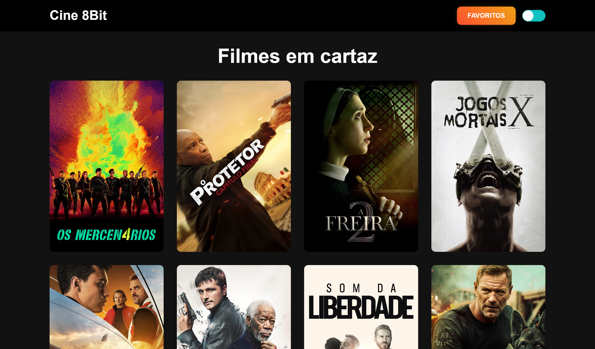

# Projeto Cine8Bit



## 💭 Descrição

Este projeto é uma aplicação web construída com React que permite visualizar informações sobre filmes em cartaz. Ele utiliza a API The Movie Database (TMDb) para obter detalhes sobre filmes, incluindo títulos, sinopses, elenco e muito mais.

## 🧠 Funcionalidades

✔️ **Consumo de API:** Integra-se à API para obter informações atualizadas em tempo real sobre os filmes em cartaz.

✔️ **Listagem de Filmes em Cartaz:** Exibe uma lista de filmes atualmente em cartaz.

✔️ **Detalhes do Filme:** Permite aos usuários visualizar informações detalhadas sobre um filme específico, incluindo título, sinopse e classificação.

✔️ **Favoritos:** Permite aos usuários marcar filmes como favoritos para acessá-los posteriormente.

✔️ **Layout Responsivo:** A página é otimizada para ser visualizada em diferentes dispositivos e tamanhos de tela, garantindo uma experiência de usuário consistente.

✔️ **Modo Dark/Light:** Permite aos usuários alternar entre os modos escuro e claro para uma experiência de visualização mais confortável.

## 🖥️ Tecnologias Utilizadas

- [React](https://react.dev) - biblioteca para interfaces de usuário
- [Vite](https://vitejs.dev) - ferramentas para front-end
- [Typescript](https://www.typescriptlang.org) - superset, linguagem baseada em javascript
- [Styled-Components](https://styled-components.com) - CSS em javascript
- [Axios](https://axios-http.com) - Uma biblioteca para requisições HTTP

## 🛠️ Modificando o projeto

### Siga as seguintes instruções para instalar e poder modificar o projeto em sua máquina:

### 📋 Pré-requisitos:

Para baixar, executar e modificar o projeto, você precisa ter instalado em sua máquina:

- [Node](https://nodejs.org/en)
- Um gerenciador de pacotes, como o [PNPM](https://pnpm.io), [Npm](https://nodejs.org/en/) ou [Yarn](https://classic.yarnpkg.com/lang/en/docs/install)
- [Git](https://git-scm.com/downloads)
- Editor de código ou IDE, como o [VSCode](https://code.visualstudio.com/Download)
- Uma key de acesso do [The Movie Database](https://www.themoviedb.org/settings/api)

### 🔧 Instalação e execução

1. Clone o repositório

```bash
git clone https://github.com/aleretamero/cine8bit.git
```

2. Acesse a pasta do projeto

```bash
cd cine8bit
```

3. Instale as dependências

```bash
npm install
# ou
pnpm install
# ou
yarn install
```

4. Inicie o servidor de desenvolvimento do projeto

```bash
npm run dev
# ou
pnpm dev
# ou
yarn dev
```

5. Crie um arquivo `.env` na raiz do projeto e nele você coloca `VITE_API_KEY="KEY"` altere a `"KEY"` pela chave gerada no The Movie Database.

Obs: o servidor iniciará na porta 5173 - acesse por: <http://localhost:5173/>

## Colaboradores 🤝🤝

| Foto                                                       | Nome                                                 |
| ---------------------------------------------------------- | ---------------------------------------------------- |
|  | [Alexandre Retamero](https://github.com/aleretamero) |

## Licença

[MIT](https://choosealicense.com/licenses/mit/)
